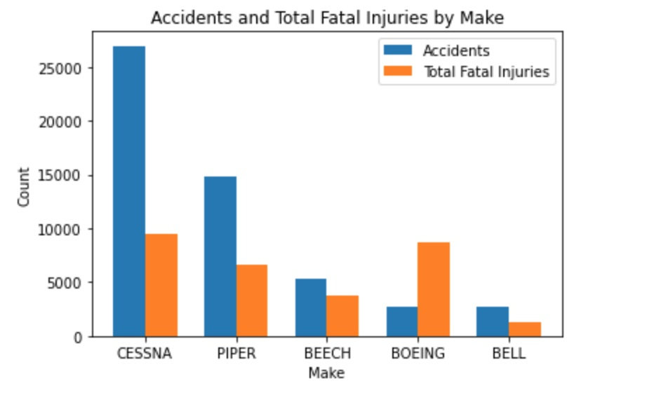
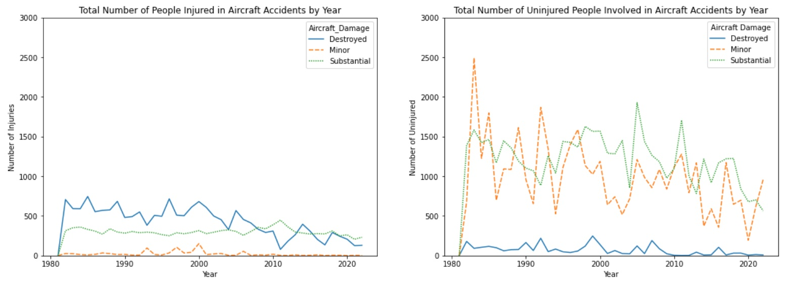
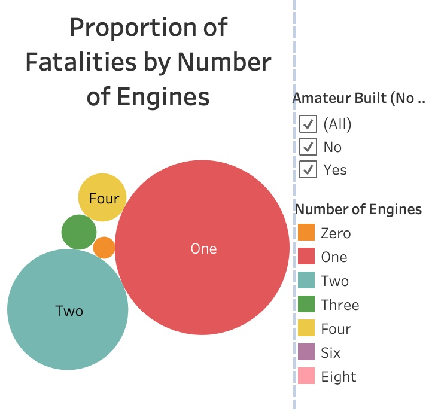

# Aircraft Safety Analysis

**Author**: [Christopher Miley](www.linkedin.com/in/christopher-ryan-miley)

## Overview

This project analyzes the dataset released by the [National Transportation Safety Board](https://www.ntsb.gov/Pages/home.aspx) (NTSB) regarding accident aviation data from 1962 to 2023. The analysis undertaken shows the various factors that play a role in aviation accidents, as well as which companies have the most troubline safety record. A business can use this data to make the best decision on aircraft purchases, while prioritizing safety.

## Business Problem

A company is expanding in to new industries to diversify its portfolio. Specifically, they are interested in purchasing and operating airplanes for commercial and private enterprises, but do not know anything about the potential risks of aircraft. Using the NTSB dataset, I determine which aircraft are the lowest risk for the company to start this new business endeavor. I then translate my findings into actionable insights that the head of the new aviation division can use to help decide which aircraft to purchase.

## Data 

The NTSB released a dataset about civil aviation accidents ranging from 1962-2023, as well as selected incidents in the US and international waters. Some of the aircraft information the dataset provides includes the make, model, number of engines, and the damage to the aircraft. Additionally, information is provided in the number of injuries, the extent of the injuries, and the number of uninjured.

## Methods

This project uses descriptive analysis, including analysis of injured passengers over the period of 1980 - present day, as well as the safety records of the five biggest companies in the dataset, factoring in the number of engines and extent of aircraft damage. This provides key insights to optimizing the decision to purchase the safest aircrafts.

## Results

Companies like Cessna have the biggest history of accidents and fatalities, but companies like Boeing have a far worse ratio of accidents to fatalities. 



The severity of passenger injuries are clearly and directly impacted by the severity of the aircraft damage.



There is a negative correlation between the number of engines on an aircraft involved in an accident and the number of fatalities as a result of the accident. In other words, the higher the number of engines, the lower the number of fatalities. 



## Conclusions

The conducted analysis leads to three recommendations for optimal aircraft purchasing:

- **Avoid Cessna and Boeing.** Cessna's frequency of appearances all over this dataset suggests a large history of aviation accidents and poses a risk to passengers. Boeing's soaring rate of fatalities in comparison to its frequency of accidents is also alarming and arguably more of a safety risk than Cessna.

- **Purchase more durable aircraft.** There is a direct relationship between the level of destruction of the aircraft and the total number of injuries. Companies like McDonnell Douglas are far less likely to have a more severe accident than companies like Cessna and Piper. 

- **Purchase aircraft with at least four or more engines.** The negative correlation between the number of engines and the number of fatalities is inarguable, and fatalities drop substantially for accidents involving aircraft with four or more engines. 

## For More Information

See the full analysis in the [Jupyter Notebook](./notebook.ipynb) or review this [presentation](./Presentation.pdf).

For additional info, contact Christopher Miley at [chrismiley87@gmail.com](mailto:chrismiley87@gmail.com)

## Repository Structure

```
├── data
├── images
├── notebook.ipynb
├── Presentation.pdf
└── README.md
```